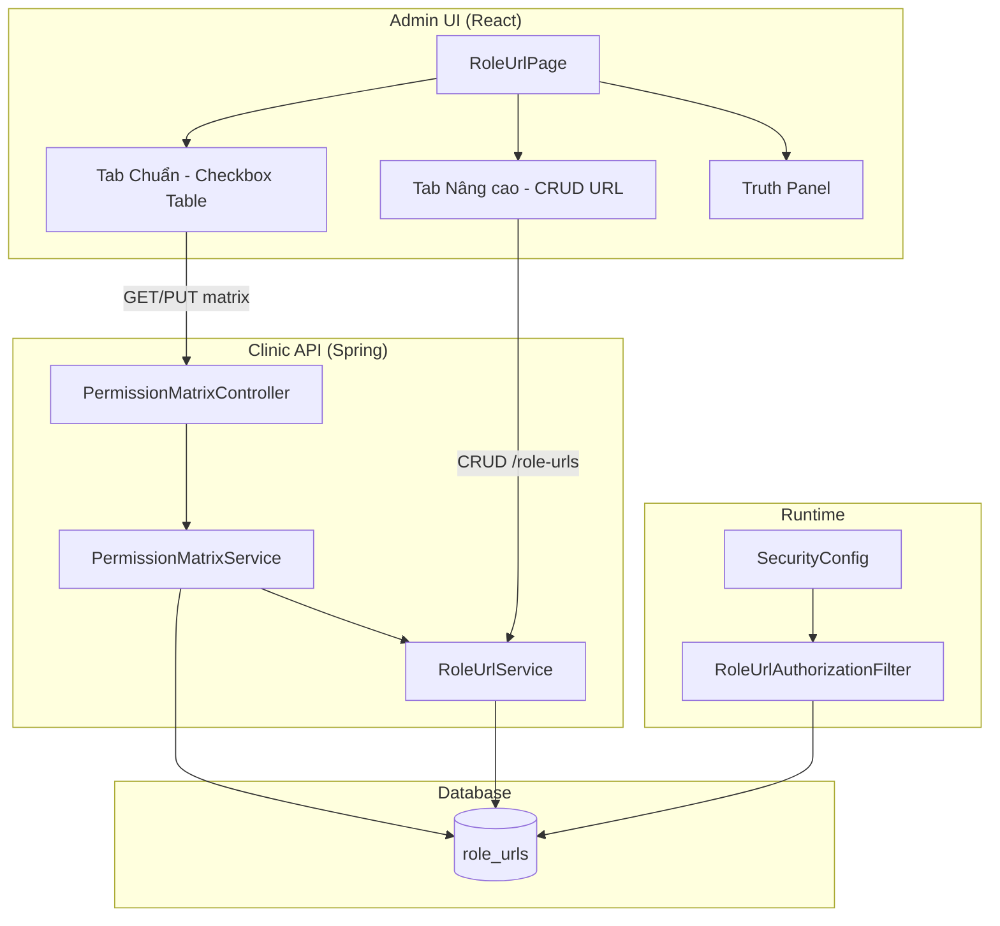

# Design Brief: RBAC Permission Matrix UX (Tài liệu Thiết kế: Ma trận phân quyền)

> [!NOTE]
> **Tài liệu này dùng để làm gì?**  
> Đây là bản thiết kế kiến trúc chi tiết (Design Brief) phác thảo cách thức nâng cấp tính năng phân quyền trong hệ thống. Giao diện cấu hình phân quyền cũ vốn phức tạp và khó dùng vì bắt người dùng tự nhập tay URL, sẽ được chuyển đổi thành một ma trận chọn dạng lưới (Xem/Thêm/Sửa/Xóa x Các Module nghiệp vụ), giúp người dùng thông thường cũng có thể phân quyền dễ dàng.

## Understanding Lock (Thống nhất các điểm mấu chốt)


| Câu hỏi | Trả lời đã chốt |
|---------|------------------|
| Ai cấu hình? | ADMIN trên Admin Clinic |
| Ai bị ảnh hưởng? | STAFF, DOCTOR, PATIENT (API + menu Sidebar) |
| Lưu trữ quyền? | Bảng `role_urls` (không đổi tên bảng) |
| Enforcement? | `RoleUrlAuthorizationFilter` (không đổi thuật toán match) |
| UX chính? | Matrix module × CRUD + Tab Nâng cao |
| Điều kiện an toàn? | **Phase 0 bắt buộc** trước matrix UI |

---

## Architecture Overview



---

## Phase 0 — Security Hardening

### Mục tiêu

Đảm bảo RoleUrl là lớp kiểm soát có ý nghĩa; UI matrix không “ảo”.

### Thay đổi

1. **`RoleUrlAuthorizationFilter.PUBLIC_PATHS`**
   - **Giữ:** `/api/auth/**`, static assets, endpoints guest đã document.
   - **Gỡ** (nếu không còn lý do product): `/api/doctors/**`, `/api/users/**`, `/api/appointments/**`, `/api/prescriptions/**`, `/api/medical-records/**`, `/api/services/**`, `/api/rooms/**`, …

2. **`SecurityConfig`**
   - Rà soát `permitAll()` GET/POST — chỉ giữ cho luồng không đăng nhập (xem danh sách bác sĩ công khai, đặt lịch guest, …).
   - Mọi thao tác admin/staff sau login → `authenticated()` + filter.

3. **Tài liệu:** `docs/security-public-endpoints.md`

### Acceptance

- Request authenticated STAFF tới endpoint protected không có RoleUrl → **403**.
- Guest flow đã document vẫn **200**.

---

## Phase 1 — Data Model

### Migration

```sql
ALTER TABLE role_urls
  ADD COLUMN permission_source VARCHAR(16) NOT NULL DEFAULT 'MANUAL',
  ADD COLUMN matrix_module VARCHAR(64) NULL;

CREATE INDEX idx_role_urls_matrix
  ON role_urls (role_id, matrix_module, permission_source);
```

### Entity `RoleUrl`

| Field | Type | Notes |
|-------|------|-------|
| `permissionSource` | enum `MANUAL`, `MATRIX` | default MANUAL |
| `matrixModule` | String nullable | e.g. `doctors` — chỉ khi MATRIX |

Existing rows → `MANUAL`, `matrix_module = null`.

### Pattern canonicalization (blocking)

Hiện tại DB có **hai convention** (xác minh từ Flyway):

| Nguồn | Ví dụ pattern |
|-------|----------------|
| V15, DataInitializer | `/appointments/**` |
| V20 | `/api/appointments/**` |

Filter match cả hai, nhưng matrix/Sidebar cần **một chuẩn**. Phase 0/T1 phải chạy migration normalize trước khi bật matrix API.

---

## Phase 2 — Permission Matrix API

### Endpoints

| Method | Path | Mô tả |
|--------|------|-------|
| GET | `/api/roles/{roleId}/permission-matrix` | Matrix state + manual list + warnings |
| PUT | `/api/roles/{roleId}/permission-matrix` | Replace MATRIX rows (transactional) |

### Request body (PUT)

```json
{
  "modules": {
    "doctors": { "view": true, "create": false, "edit": true, "delete": false },
    "appointments": { "view": true, "create": true, "edit": true, "delete": false }
  }
}
```

### Translation rules

| UI action | HTTP methods | urlPattern |
|-----------|--------------|------------|
| view | GET | `/{moduleKey}/**` |
| create | POST | `/{moduleKey}/**` |
| edit | PUT, PATCH | `/{moduleKey}/**` |
| delete | DELETE | `/{moduleKey}/**` |

- **Không** dùng prefix `/api` trong DB (khớp `DataInitializer`).
- Catalog module → path map trong `PermissionModuleCatalog` (Java enum hoặc config class).

### PUT algorithm (`@Transactional`)

```
FOR EACH moduleKey IN payload.modules:
  DELETE FROM role_urls
    WHERE role_id = :roleId
      AND permission_source = 'MATRIX'
      AND matrix_module = :moduleKey
  FOR EACH enabled action:
    INSERT role_urls (..., permission_source='MATRIX', matrix_module=:moduleKey)
RETURN computed matrix + manualPermissions + warnings
```

**Không** DELETE rows `MANUAL`.

### GET reverse mapping

- Rows `MATRIX` + `matrix_module` → set checkbox.
- Unchecked action = không có row tương ứng (không infer từ MANUAL).

### Warnings

- `MANUAL` row path overlaps module prefix nhưng matrix tắt → `CONFLICT_MANUAL_MATRIX`
- Path matches `PUBLIC_PATHS` / permitAll → `BYPASS_ACTIVE` (truth panel)

---

## Module Catalog (v1)

### Standard Matrix (16 modules)

| Group | Key | Label (VI) | Path |
|-------|-----|------------|------|
| Quản trị | users | Người dùng | `/users/**` |
| Quản trị | roles | Vai trò | `/roles/**` |
| Quản trị | role-urls | Phân quyền | `/role-urls/**` |
| Nhân sự | doctors | Bác sĩ | `/doctors/**` |
| Nhân sự | specializations | Chuyên khoa | `/specializations/**` |
| Cơ sở | rooms | Phòng | `/rooms/**` |
| Cơ sở | services | Dịch vụ | `/services/**` |
| Đặt chỗ | room-bookings | Đăng ký phòng | `/room-bookings/**` |
| Đặt chỗ | appointments | Lịch hẹn | `/appointments/**` |
| Đặt chỗ | health-package-bookings | Đặt gói khám | `/health-package-bookings/**` |
| Đặt chỗ | online-consultations | Tư vấn online | `/online-consultations/**` |
| Lâm sàng | health-packages | Gói khám | `/health-packages/**` |
| Lâm sàng | medical-records | Hồ sơ bệnh án | `/medical-records/**` |
| Lâm sàng | prescriptions | Đơn thuốc | `/prescriptions/**` |
| Lâm sàng | service-registrations | ĐK dịch vụ | `/service-registrations/**` |
| Xét nghiệm | lab-orders | Chỉ định XN | `/lab-orders/**` |

### Advanced-only (không matrix v1)

`hospitals`, `health-package-schedules`, `dashboard`, `medical-ocr`, `medical-ai-analysis`, `chat`, `machine-learning`

### Catalog API response (cho bảng UI)

```json
{
  "groups": [
    {
      "id": "admin",
      "label": "Quản trị",
      "modules": [
        { "key": "users", "label": "Quản lý người dùng", "path": "/users/**" },
        { "key": "roles", "label": "Quản lý vai trò", "path": "/roles/**" }
      ]
    }
  ]
}
```

Frontend flatten `groups[].modules` → rows; chèn header row khi `group` đổi.

---

## Phase 3 — Admin UI

### UX reference (checkbox matrix)

Giao diện Tab **Chuẩn** bám layout enterprise phổ biến (ma trận tích chọn):

- Một **chức vụ (Role)** được chọn → bảng quyền cho role đó
- Mỗi **hàng = một module/tài nguyên**
- Mỗi **cột = một hành động** (Xem / Thêm / Sửa / Xóa)
- Ô **checkbox** tại giao điểm hàng × cột
- Cột **Tất cả** = chọn/bỏ chọn cả 4 quyền trên một hàng

### Layout (wireframe)

```
┌─────────────────────────────────────────────────────────────────────────────┐
│ Phân quyền theo chức vụ          Role: [ STAFF        ▼ ]    [ Lưu ]       │
├─────────────────────────────────────────────────────────────────────────────┤
│ ⚠ Truth panel: 0 bypass (hoặc danh sách)                                    │
├─────────────────────────────────────────────────────────────────────────────┤
│ [ Chuẩn ]  [ Nâng cao ]                                                     │
├─────────────────────────────────────────────────────────────────────────────┤
│ 🔍 Tìm nhanh module...                          [ Quản lý cột ▼ ]           │
├────┬──────────────────────┬─────────────┬─────┬──────┬──────┬──────┬───────┤
│ STT│ Tên tài nguyên       │ Mã tài nguyên│ Xem │ Thêm │ Sửa  │ Xóa  │ Tất cả│
├────┼──────────────────────┼─────────────┼─────┼──────┼──────┼──────┼───────┤
│ 1  │ Quản lý người dùng   │ users       │ ☐   │ ☐    │ ☐    │ ☐    │ ☐     │
│ 2  │ Quản lý bác sĩ       │ doctors     │ ☑   │ ☐    │ ☑    │ ☐    │ ☐     │
│ …  │ (16 dòng + nhóm)     │             │     │      │      │      │       │
└────┴──────────────────────┴─────────────┴─────┴──────┴──────┴──────┴───────┘
```

### Cột bảng (Tab Chuẩn)

| Cột | Field | Hiển thị mặc định | Ghi chú |
|-----|-------|------------------|---------|
| STT | — | Có | Số thứ tự trong danh sách (sau filter) |
| Tên tài nguyên | `label` từ catalog | Có | Tiếng Việt, ví dụ "Quản lý bác sĩ" |
| Mã tài nguyên | `key` | Có (ẩn được) | `doctors`, `appointments` — cho Super Admin |
| Quyền Xem | `view` | Có | → GET |
| Quyền Thêm | `create` | Có | → POST |
| Quyền Sửa | `edit` | Có | → PUT + PATCH |
| Quyền Xóa | `delete` | Có | → DELETE |
| Tất cả | `all` | Có | Master checkbox hàng; indeterminate khi 1–3 ô bật |

### Hành vi tương tác

| Hành động | Behavior |
|-----------|----------|
| Tick **Tất cả** (hàng) | Bật view + create + edit + delete cho module đó |
| Bỏ tick **Tất cả** | Tắt cả 4 quyền hàng đó |
| Tick/bỏ từng ô CRUD | Cập nhật ô **Tất cả**: checked nếu cả 4 bật; indeterminate nếu một phần; unchecked nếu cả 4 tắt |
| **Tìm nhanh** | Lọc theo `label` hoặc `key` (client-side); STT đánh lại 1..n |
| **Quản lý cột** | Toggle hiện/ẩn cột **Mã tài nguyên** (mặc định: hiện) |
| **Nhóm module** | Dòng header phân cách (không checkbox): "Quản trị", "Đặt chỗ", … — optional sticky |
| **Lưu** | Mở modal preview diff → PUT full 16 module |

### Layout tổng thể (không đổi)

1. **Header:** Dropdown Role + nút Lưu (trang có thể deep-link `?roleId=&roleName=` như hệ thống mẫu)
2. **Truth panel:** Số endpoint bypass; link doc
3. **Tabs:** Chuẩn | Nâng cao
4. **Tab Chuẩn:** Bảng matrix như trên (ưu tiên bảng phẳng; nhóm chỉ là header row)
5. **Modal Preview:** Diff xanh/đỏ trước PUT
6. **Tab Nâng cao:** Table/modal CRUD URL hiện tại; badge `MANUAL`

### Styling (gợi ý)

- Checkbox vuông, trạng thái checked dùng `--primary` (đỏ/hồng brand admin hiện tại)
- Header bảng sticky khi scroll dọc
- Hover hàng nhẹ để dễ quét mắt

### i18n

Keys mới under `roleUrl.matrix.*` (vi + en), ví dụ:

- `roleUrl.matrix.col.resourceName`, `col.resourceCode`, `col.view`, `col.create`, `col.edit`, `col.delete`, `col.selectAll`
- `roleUrl.matrix.searchPlaceholder` = "Tìm nhanh module..."
- `roleUrl.matrix.manageColumns` = "Quản lý cột"

### Sidebar (Phase 4 — optional)

Giảm hardcode STAFF/DOCTOR; ưu tiên GET từ `/role-urls/by-role`. Giữ rule nghiệp vụ đặc biệt có comment.

---

## Decision Log

| ID | Decision | Rationale |
|----|----------|-----------|
| D1 | Phase 0 mandatory | Multi-agent Guardian/Skeptic — tránh security theater |
| D2 | DB columns vs description tag | Tránh zombie/parse errors |
| D3 | PATCH ∈ edit | DataInitializer seeds PATCH |
| D4 | Không sửa filter core | Constraint Guardian — regression risk |
| D5 | Checkbox matrix table (ảnh mẫu) | Hàng module × cột CRUD + Tất cả; search + quản lý cột |
| D7 | Header row nhóm (optional) | Giảm tải nhận thức, không thay accordion thu gọn |
| D6 | Advanced-only modules | Codebase — OCR/chat không thuộc admin matrix |

---

## Out of Scope (v1)

- Optimistic locking version column trên role (có thể v2)
- Tách Functional Core Rust-style (rejected — over-engineering)
- Auto-sync OpenAPI → modules

---

## Files Touched (expected)

**Backend:** `RoleUrl.java`, migration SQL, `PermissionMatrixController`, `PermissionMatrixService`, `PermissionModuleCatalog`, `RoleUrlService`, `RoleUrlResponse`, `RoleUrlAuthorizationFilter`, `SecurityConfig`, tests

**Frontend:** `RoleUrlPage.tsx`, i18n, có thể `api` service types

**Docs:** `docs/security-public-endpoints.md`
