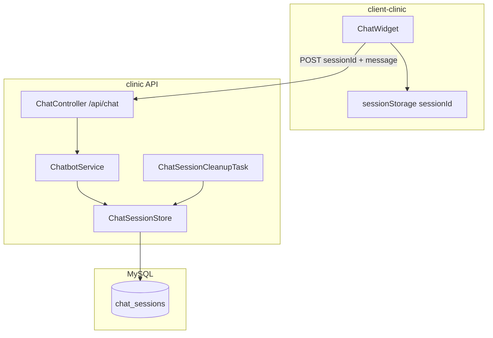

# Design Brief: Remove Redis — Chat Session in MySQL

## Understanding Lock

| Câu hỏi | Trả lời đã chốt |
|---------|------------------|
| Redis dùng để làm gì? | Chỉ chatbot session state (`ChatbotService`) |
| Ai dùng? | Bệnh nhân qua `ChatWidget` → `POST /api/chat` |
| State gồm gì? | `intent`, `bookingStep`, `chatHistory` (≤10), `extractedParams`, … |
| TTL? | 30 phút (sliding — gia hạn mỗi lần save) |
| Phương án? | **A** — bảng `chat_sessions` + JSON blob |

---

## Architecture (sau thay đổi)



---

## Schema

```sql
chat_sessions (
  session_id  VARCHAR(64) PK,
  user_id     BIGINT NULL,
  state_json  JSON NOT NULL,
  expires_at  DATETIME(3) NOT NULL,
  updated_at  DATETIME(3) NOT NULL,
  INDEX (expires_at)
)
```

---

## State contract (không đổi semantics)

| Key | Mô tả |
|-----|--------|
| `intent` | BOOKING, SEARCH, SYMPTOM, … |
| `bookingStep` | IDENTIFY_SPEC → SELECT_DOCTOR → SELECT_TIME → CONFIRM |
| `chatHistory` | List `{role, content}`, max 10 entries |
| `extractedParams` | Object từ `DataExtractionService` (structured RAG) |

---

## Safeguards (từ multi-agent quorum)

1. **Fail-fast** — `ChatSessionPersistenceException` → user message lỗi, không nuốt exception.
2. **Validate `sessionId`** — pattern `^[a-zA-Z0-9_-]{8,64}$` (client format `chat-...` hợp lệ).
3. **Purge job** — mỗi 10 phút xóa row hết hạn.
4. **sessionStorage** — F5 không tạo session mới.

---

## Removal checklist

- `RedisService`, `RedisServiceTest`
- `spring-boot-starter-data-redis`
- `spring.data.redis.*` trong `application.properties`
- `REDIS_HOST` trong `.env.example`, `dev-local.sh`, README

---

## Phase 2 (future — Option B)

Nếu cần admin xem lịch sử từng tin: tách `chat_messages`, migrate từ `chatHistory` trong JSON.
